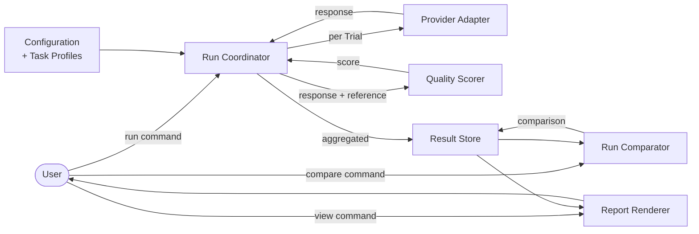

# 01. アーキテクチャ概要 (Architecture)

本書はシステム全体像を示します。コンポーネント詳細は [02-components.md](02-components.md)、データの形は [03-data-model.md](03-data-model.md)、利用フローは [04-workflows.md](04-workflows.md) を参照してください。

## 設計原則

| ID | 原則 |
| --- | --- |
| ARCH-00001 | 「ユーザーの PC・用途で最適なモデルを選ぶ」を唯一の中心目的とする。これに寄与しない機能は持ち込まない |
| ARCH-00002 | 計測対象 (品質 / 性能) と計測手段 (provider) を分離する。provider 追加が評価ロジックに波及してはならない |
| ARCH-00003 | 結果は機械可読が一次、人間可読は派生形とする |
| ARCH-00004 | LLM 応答の揺れは複数 Trial 集計で吸収する。単発の値を結果として扱わない |
| ARCH-00005 | Task Profile と Case はツール本体から物理的に分離可能とする (BYO データ) |
| ARCH-00006 | 依存は標準ライブラリを優先する。導入する外部依存は要件 ID と紐付けて記録する |

## 中心責務 (4 層)

システムは次の 4 層で構成します。各層は隣接層のみと依存関係を持ちます。

```
┌────────────────────────────────────────────┐
│ Presentation (CLI / Report)                │  ユーザー入出力
├────────────────────────────────────────────┤
│ Orchestration (Run Coordinator,            │  Run の進行・統計集計
│                Run Comparator)             │  Run 群を束ねる Comparison
├────────────────────────────────────────────┤
│ Measurement (Provider Adapter,             │  1 Trial の計測単位
│              Quality Scorer)               │
├────────────────────────────────────────────┤
│ Configuration & Storage                    │  入力読込・結果保存
└────────────────────────────────────────────┘
```

| ID | 層 | 主な責務 |
| --- | --- | --- |
| ARCH-00101 | Presentation | ユーザー操作の受付。結果表示の人間可読化 |
| ARCH-00102 | (superseded by ARCH-00105) Orchestration | Task × Model × Trial の組合せ実行と統計集計 |
| ARCH-00103 | Measurement | 1 Trial 分の推論実行 (Provider Adapter) と決定的採点 (Quality Scorer) |
| ARCH-00104 | Configuration & Storage | 設定読込、Run 結果の永続化と読出し |
| ARCH-00105 | Orchestration | Task × Trial (単一 Model) の組合せ実行と Run 内統計集計、および複数 Run を束ねる Comparison の組成 |

## データの流れ (高位)



Run は 1 ModelCandidate に対する単一の計測単位であり、複数モデル比較はユーザーが Run を複数回実行した上で `compare` 経由の Comparison として束ねる構造とする (FUN-00207, FUN-00309)。

## 主要な設計判断

| ID | 判断 | 根拠 |
| --- | --- | --- |
| ARCH-00201 | provider との通信は Provider Adapter 単一責務に閉じる | NFR-00201, ARCH-00002 |
| ARCH-00202 | 評価ロジックは scorer 単位で分離し、Task Profile から名前で参照する | NFR-00202 |
| ARCH-00203 | Run の最小単位は Trial。Case 集計と Run 集計は Trial の畳み込みで構成する | NFR-00101, FUN-00303 |
| ARCH-00204 | 結果は Run 単位で 1 ディレクトリに収め、原子的に完成させる | NFR-00101, NFR-00502 |
| ARCH-00205 | Presentation 層は Orchestration の結果を直接読まず、Result Store 経由で取得する | ARCH-00103, FUN-00307 |
| ARCH-00206 | Comparison は Run の上位集計単位として定義する。Comparison は Run の集計値のみを入力にし、Trial 個別値や生応答を直接参照しない | FUN-00308, FUN-00309, NFR-00201 |
| ARCH-00207 | provider プロセスのモデル swap によるレイテンシ混入を排除するため、1 Run = 1 Model を計測公平性の前提とする。複数モデル比較は Comparison で行う | NFR-00101, NFR-00303, OOS-00006 |

## 想定する非機能上の境界

| ID | 境界 |
| --- | --- |
| ARCH-00301 | 同時 Run は 1 とする。並列実行は v1 では考慮しない |
| ARCH-00302 | Run 中の状態は揮発を許容する。Run 完了時に永続化を保証する |
| ARCH-00303 | 認証情報は Configuration 層がメモリ内に保持し、Storage への書き出しを禁止する |

## 拡張ポイント

将来の拡張は次の点に閉じる前提で v1 を構築します。

- 新 provider 追加: Provider Adapter の追加のみ
- 新 scorer 追加: Quality Scorer の追加のみ
- 新出力形式: Report Renderer の追加のみ
- 新計測軸 (TTFT / RAM 等): Measurement 層と Result スキーマの拡張

それぞれの拡張点で他層の改修が要らないことを v1 設計の合格条件とします。
