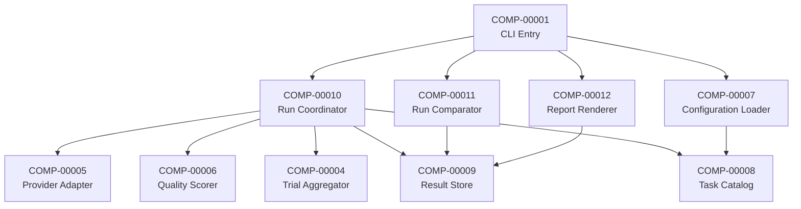

# 02. コンポーネント (Components)

[01-architecture.md](01-architecture.md) の 4 層を、責務単位のコンポーネントに分割します。実装上のクラス名・関数名・ファイル名には踏み込みません。

## コンポーネント一覧

| ID | コンポーネント | 所属層 |
| --- | --- | --- |
| COMP-00001 | CLI Entry | Presentation |
| COMP-00002 | (superseded by COMP-00012) Report Renderer | Presentation |
| COMP-00003 | (superseded by COMP-00010) Run Coordinator | Orchestration |
| COMP-00004 | Trial Aggregator | Orchestration |
| COMP-00005 | Provider Adapter | Measurement |
| COMP-00006 | Quality Scorer | Measurement |
| COMP-00007 | Configuration Loader | Configuration & Storage |
| COMP-00008 | Task Catalog | Configuration & Storage |
| COMP-00009 | Result Store | Configuration & Storage |
| COMP-00010 | Run Coordinator | Orchestration |
| COMP-00011 | Run Comparator | Orchestration |
| COMP-00012 | Report Renderer | Presentation |

## 依存関係 (許可される向き)

逆向き依存 (Adapter から Coordinator など) は禁止します。

## 各コンポーネントの責務

### COMP-00001 CLI Entry
- ユーザーからの操作受付。サブコマンドの解析と各コンポーネントへの委譲。
- 出力先 (標準出力 / ファイル) の制御。
- `check` / `config lint` / `system-probe` / `config dry-run` に加え、`provider status` / `model pull` / `model warmup` を同一 CLI 上で提供する。read-only な観測面と explicit な provider preparation 面を分離し、責務を交差させない。
- 関連: FUN-00104, FUN-00207, FUN-00307, FUN-00308, FUN-00309, FUN-00404, FUN-00405, FUN-00406, FUN-00407, FUN-00408, FUN-00409, FUN-00410, NFR-00002

### COMP-00002 (superseded by COMP-00012) Report Renderer
- Run 表示にランキングを含めていた旧責務。Comparison との分離を反映させるため COMP-00012 で再定義した。

### COMP-00003 (superseded by COMP-00010) Run Coordinator
- Task Profile × Model Candidate × Trial の組合せを制御していた旧責務。1 Run = 1 Model と Comparator の分離に伴い COMP-00010 で再定義した。

### COMP-00004 Trial Aggregator
- 同一 Case の複数 Trial を、Case 集計値 (n, mean, p50, p95) に畳み込む。
- Run 全体集計を Case 集計から生成する。Run は単一モデルのため、「Run 全体」は単一モデルの集計と同じ。複数 Run 横断の集計は本コンポーネントの責務ではなく、Run Comparator (COMP-00011) が担う。
- 関連: FUN-00303, NFR-00101

### COMP-00005 Provider Adapter
- 1 Trial 分の推論実行を担う。provider 種別ごとに 1 実装を持つ。
- 入力: 標準化された推論リクエスト。出力: 標準化された推論レスポンス (応答テキスト + 性能 metric + 生応答)。
- provider 固有の設定はこのコンポーネント内に閉じる。
- 推論に加え、read-only な status / probe と explicit な provider preparation operation (`model pull` / `model warmup`) を担う。`system-probe` / `config dry-run` / `provider status` は観測系契約を、`model pull` / `model warmup` は preparation 契約を再利用し、上位層は provider 固有 endpoint を直接扱わない。
- 関連: FUN-00302, FUN-00404, FUN-00405, FUN-00407, FUN-00408, FUN-00409, FUN-00410, NFR-00201, NFR-00303, ARCH-00201

### COMP-00006 Quality Scorer
- 推論レスポンスと期待出力から、決定的な品質スコアを算出する。
- scorer 単位で実装を分離し、Task Profile から名前で選択される。
- 関連: FUN-00302, NFR-00202, ARCH-00202

### COMP-00007 Configuration Loader
- 設定ファイル群を読み込み、整合性検証を行う。
- 認証情報は環境変数経由でのみ取得し、設定ファイル中の平文を拒否する。
- `check`、`config lint`、Run 開始前検証、`config dry-run`、`system-probe`、`provider status`、`model pull`、`model warmup` が使う設定ソースを供給する。単一設定ファイルの検証では、必要最小限の補助設定ソース解決も担う。provider への動的通信自体は担わない。
- 関連: FUN-00105, FUN-00402, FUN-00404, FUN-00405, FUN-00406, FUN-00407, FUN-00408, FUN-00409, FUN-00410, NFR-00401

### COMP-00008 Task Catalog
- Task Profile と Case の集合を提供する。
- ツール本体とは独立した場所からの読込を可能にする (BYO データ)。
- 関連: FUN-00101, FUN-00102, FUN-00104, NFR-00203, ARCH-00005

### COMP-00009 Result Store
- Run 結果を Run 識別子単位でディレクトリに保存し、後段の参照を提供する。
- Comparison も Comparison 識別子単位で保存し、Run 識別子集合とランキング軸設定を含める。
- 生応答と正規化済み集計値を分離して保存する。
- 結果スキーマには版を埋め込む。
- 関連: FUN-00206, FUN-00307, FUN-00309, FUN-00401, FUN-00403, NFR-00103, NFR-00204, ARCH-00204

### COMP-00010 Run Coordinator
- Run の進行を司る単一の制御点。1 Run は 1 ModelCandidate を対象とする (FUN-00207, ARCH-00207)。
- Task Profile × Trial の組合せを生成し、Provider Adapter と Quality Scorer を順に呼ぶ。
- 個別 Trial の失敗を Run 全体の失敗に波及させない。
- 複数モデル比較は本コンポーネントの責務ではなく、ユーザーが Run を複数回実行し Run Comparator (COMP-00011) に委ねる。
- 関連: FUN-00207, FUN-00202, FUN-00204, FUN-00205, FUN-00206, NFR-00501, ARCH-00207

### COMP-00011 Run Comparator
- ユーザーが指定した複数 Run 識別子を入力とし、同一 Task Profile セットを対象とする Run 群を束ね Comparison を生成する。
- Run ごとの集計値 (CaseAggregation 由来) のみを読み、モデル横断ランキング (品質重視 / 速度重視 / 統合) を算出する。
- 入力 Run の Task Profile セット不一致を検知し、不整合を報告する。
- 関連: FUN-00308, FUN-00309, FUN-00310, ARCH-00206, NFR-00201

### COMP-00012 Report Renderer
- Result Store から取得した Run 結果または Comparison 結果を、人間可読 (Markdown 等) と機械可読 (JSON 等) に変換する。
- Run 表示は単一モデルの集計表を、Comparison 表示はモデル横断のランキング表を主体とする。
- Comparison 表示ではランキングの軸 (品質重視・速度重視・統合) を指定して並び替える。
- 関連: FUN-00302, FUN-00305, FUN-00307, FUN-00308, FUN-00310, NFR-00004

## コンポーネント外の責務

次は本ツールが持たない責務です。利用者または provider 側に委ねます。

- モデルバイナリの保存と provider プロセスの常駐管理 (provider 責務)
- 認証情報の発行・更新 (利用者責務)
- ベンチマーク実行環境の用意 (利用者責務)
