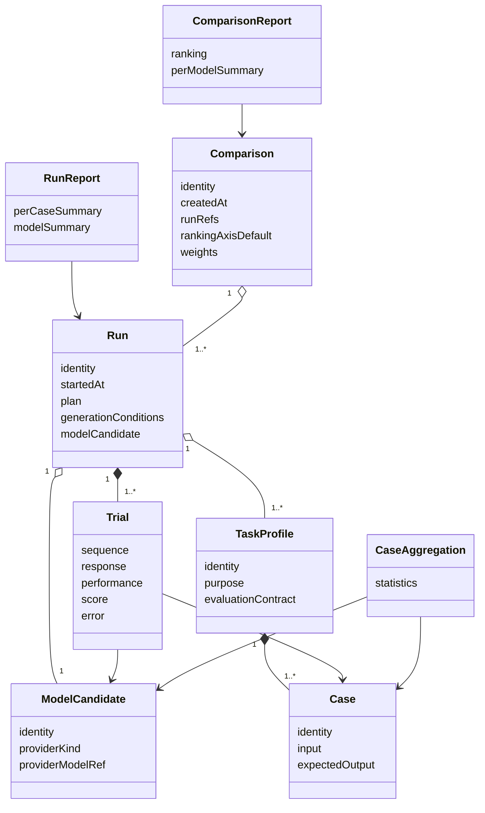

# 03. 概念データモデル (Data Model)

ツールが扱うデータを概念レベルで定義します。本書は概念モデルのみを扱い、物理スキーマのフィールド名や永続化フォーマットの細部は規定しません。

## エンティティ概要

## エンティティ定義

### DAT-00001 TaskProfile
ユーザーの用途を表す最小単位。1 つの評価契約 (どの scorer を使うか、何を比較するか) を持ち、複数の Case を束ねる。Task Profile はユーザーが定義し、ツール本体とは独立して管理可能であること。

### DAT-00002 Case
TaskProfile に属する 1 件の入力と (該当する場合) 期待出力。1 Case は 1 つ以上の Trial の対象となる。

### DAT-00003 ModelCandidate
比較対象のモデル。provider の種別と、provider 上の識別子を持つ。本ツールはモデル本体を保持せず、provider 上に存在することを前提とする。

### DAT-00004 (superseded by DAT-00008) Run
ユーザーが指定した「TaskProfile 群 × ModelCandidate 群 × n 回試行」の一回分の実行単位として定義していた。複数 ModelCandidate を含む表現は 1 Run = 1 Model 方針 (FUN-00207, ARCH-00207) と矛盾するため、DAT-00008 で再定義した。

### DAT-00005 Trial
Run の最小実行単位。Case 1 件 × ModelCandidate 1 件 × 試行回 1 回に対応する。推論レスポンス、性能 metric、品質スコア、または失敗情報を持つ。

### DAT-00006 CaseAggregation
1 Case × 1 ModelCandidate の Trial 群を畳み込んだ集計値。サンプル数、平均、p50、p95 を含む。

### DAT-00007 (superseded by DAT-00010) RunReport
Run 全体を人間がレビューする視点で再構成したものとして、ランキング・モデル別サマリ・生成条件の写しを含んでいた。ランキングは Comparison スコープへ移動したため DAT-00010 で再定義した。

### DAT-00008 Run
ユーザーが指定した「TaskProfile 群 × 1 ModelCandidate × n 回試行」の一回分の実行単位 (FUN-00207, ARCH-00207)。生成条件 (温度 / seed 等) は Run 単位で固定し記録する。複数モデルの比較は本エンティティを扱わず、Comparison (DAT-00009) で束ねる。

### DAT-00009 Comparison
同一 TaskProfile セットを対象として実行された複数 Run を束ねる成果エンティティ。入力として Run 識別子集合とランキングの既定軸・重みを持ち、出力として ComparisonReport を生成する。Comparison は作成時に入力 Run 集合を凍結し、後で Run を追加しない (追加は新 Comparison として生成)。

### DAT-00010 RunReport
Run (単一 Model) を人間がレビューする視点で再構成したもの。Case 別集計とモデルサマリ (品質 / 応答時間 / トークン消費)、生成条件の写し、provider 識別を含む。ランキングは含まない。

### DAT-00011 ComparisonReport
Comparison を人間がレビューする視点で再構成したもの。モデル別サマリとモデル横断ランキング (品質重視 / 速度重視 / 統合)、使用した重み、入力 Run 識別子集合を含む。

## 不変条件

| ID | 不変条件 |
| --- | --- |
| DAT-00101 | TaskProfile は最低 1 件の Case を持つ |
| DAT-00102 | Trial は必ず 1 件の Case と 1 件の ModelCandidate に属する |
| DAT-00103 | 同一 Case × 同一 ModelCandidate の Trial は連番で識別される |
| DAT-00104 | CaseAggregation のサンプル数は対応する Trial 群のうち成功したものに限る |
| DAT-00105 | Run の生成条件は Run 開始後に変更されない |
| DAT-00106 | RunReport / ComparisonReport の数値は CaseAggregation もしくはそれを集約したモデルサマリのみから導出され、Trial 個別値に直接アクセスしない |
| DAT-00107 | Run は初期化時に 1 件の ModelCandidate を保持し、Run 完了まで変更されない |
| DAT-00108 | Comparison は 2 件以上の Run 識別子を保持する (DAT-00109 と整合)。1 件以下では「比較」の意味が成立しないため、Run Comparator は Comparison 生成を拒否する |
| DAT-00109 | Comparison が束ねる Run 群は (1) 最小 2 件以上 かつ (2) 同一 TaskProfile セット (同一集合の TaskProfile 識別子) を対象とする。最小 2 件未満が指定された場合、または TaskProfile セットが不一致な場合、Run Comparator はエラーとして扱い Comparison 生成を拒否する |
| DAT-00110 | Comparison は作成後に入力 Run 集合を変更しない。Run を差し替える場合は新規 Comparison を作成する |

## 結果スキーマの版

| ID | 要件 |
| --- | --- |
| DAT-00201 | 永続化される結果は版識別子を持つ。版の差し替え時、過去 Run の読み出し可否を判定できる |
| DAT-00202 | 版識別子の更新時は development/traceability の変更履歴に記録する |

## 計測軸の責任分担

各計測値の出所と保持主体を明示します。実装上の互換性管理に使います。

| 計測軸 | 出所 | 保持主体 |
| --- | --- | --- |
| 応答テキスト | Provider Adapter | Trial |
| 応答時間 | Provider Adapter (provider 値) | Trial |
| トークン消費 | Provider Adapter (provider 値) | Trial |
| 品質スコア | Quality Scorer | Trial |
| 失敗情報 | Provider Adapter / Quality Scorer | Trial |
| 統計集計 (Case) | Trial Aggregator | CaseAggregation |
| モデルサマリ (Run 内) | Trial Aggregator | RunReport |
| ランキング | Run Comparator | ComparisonReport |

## 拡張時の影響範囲

| 拡張 | 影響を受けるエンティティ |
| --- | --- |
| 新 provider | ModelCandidate (provider 種別追加のみ) |
| 新 scorer | TaskProfile (評価契約での参照追加のみ) |
| 新計測軸 (TTFT 等) | Trial / CaseAggregation / RunReport / ComparisonReport |
| 新出力形式 | RunReport / ComparisonReport の派生のみ。既存エンティティは不変 |
| 新ランキング軸 | ComparisonReport のみ。Run / RunReport は不変 |
