# 04. 主要フロー (Workflows)

ユーザー操作 1 つに対する、コンポーネント間の連携を概念レベルで示します。シーケンス図はあくまで責務の流れを示すもので、実装シグネチャを規定しません。

## フロー一覧

| ID | フロー | トリガ |
| --- | --- | --- |
| FLW-00001 | (superseded by FLW-00005) Run の実行 | ユーザーが対象を指定して開始 |
| FLW-00002 | 結果の確認 | ユーザーが Run 識別子を指定 |
| FLW-00003 | 登録内容の整合性確認 | ユーザーが明示的に確認を要求 |
| FLW-00004 | 過去 Run の一覧確認 | ユーザーが一覧を要求 |
| FLW-00005 | Run の実行 (1 Run = 1 Model) | ユーザーが 1 Model + Task Profile 群を指定して開始 |
| FLW-00006 | Comparison の作成 | ユーザーが Run 識別子集合を指定 |
| FLW-00007 | 実行環境と provider 可用性の確認 | ユーザーが `system-probe` を要求 |
| FLW-00008 | 設定ソースの静的検証 | ユーザーが `config lint` を要求 |
| FLW-00009 | Run 設定の dry-run 事前確認 | ユーザーが `config dry-run` を要求 |
| FLW-00010 | provider の起動状態と inventory 確認 | ユーザーが `provider status` を要求 |
| FLW-00011 | model の pull | ユーザーが `model pull` を要求 |
| FLW-00012 | model の warmup | ユーザーが `model warmup` を要求 |

provider 側準備を含む主導線は `provider status` → `model pull` → `model warmup` → `system-probe` → `config lint` → `config dry-run` → `run` とする。既に provider と model が整っている場合は先頭 3 ステップを省略できる。`check` は既存互換の静的確認面として残す。

## FLW-00001 (superseded by FLW-00005) Run の実行

複数 ModelCandidate をループで回す代フローとして記述していた。1 Run = 1 Model 方針 (FUN-00207, ARCH-00207) に伴い FLW-00005 で再定義した。複数モデル比較は FLW-00006 (Comparison の作成) と組み合わせる。

## FLW-00005 Run の実行 (1 Run = 1 Model)

関連: FUN-00207, FUN-00202, FUN-00204, FUN-00205, FUN-00206, NFR-00501, NFR-00502

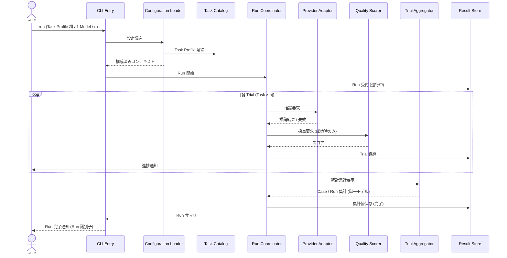

注:
- Run は 1 ModelCandidate に限定される。複数モデルを比較したい場合は、ユーザーが provider 上でモデルを入れ替えて複数回 Run を実行し、その後 FLW-00006 で束ねる。
- 個別 Trial の失敗は Run 全体を停止させない (FUN-00204)。
- 進捗通知の具体媒体は本書の対象外とする。

## FLW-00006 Comparison の作成

関連: FUN-00308, FUN-00309, FUN-00310, ARCH-00206, NFR-00201

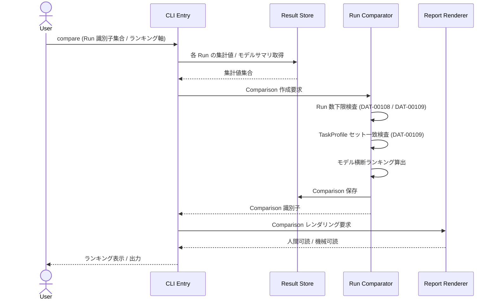

注:
- 指定された Run 集合が 2 件未満の場合、Run Comparator は Comparison を生成せず、エラーをユーザーに返す (DAT-00108 / DAT-00109)。
- TaskProfile セットが不一致な Run 集合を指定された場合、Run Comparator は Comparison を生成せず、不一致をユーザーに返す。
- ランキング軸の指定がない場合、Comparison の既定軸 (CFG-00207) を用いる。

## FLW-00002 結果の確認

関連: FUN-00307, FUN-00302, FUN-00303, FUN-00305, NFR-00004

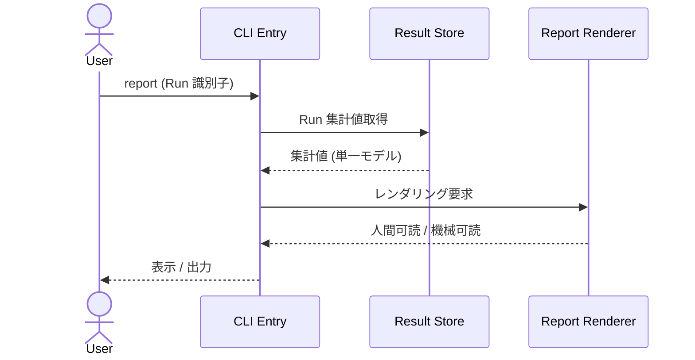

ランキング表示は本フローの対象外とし、Comparison を作成する FLW-00006 で表示する。

## FLW-00003 登録内容の整合性確認

関連: FUN-00105, FUN-00402

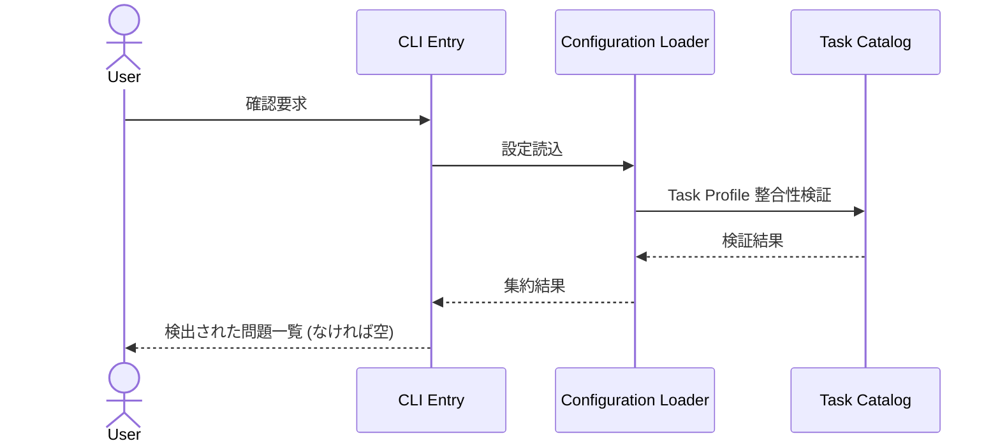

注:
- 本フローは静的検証に限定し、provider 通信と host hardware 収集は行わない。
- 本フローに含める検証は、登録内容と参照整合性の確認に限る。

本フローに含まれる検証:
- 参照される provider 種別が登録済みか
- TaskProfile が必須要素 (Case / 評価契約) を満たしているか
- 認証情報が必要な provider に対して、対応する環境変数が解決可能か
- `check` は既存互換面として本フローを維持する。利用者向け主導線の静的確認は FLW-00008 (`config lint`) を優先する。

## FLW-00008 設定ソースの静的検証

関連: FUN-00105, FUN-00402, FUN-00406

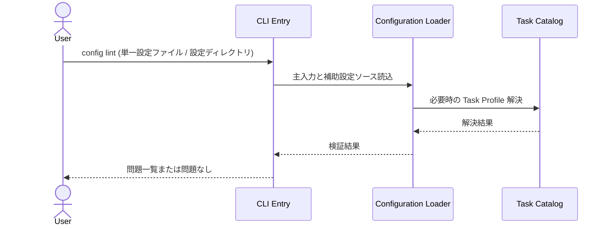

注:
- 単一ファイル入力でも、相互参照を持つ場合は必要最小限の補助設定ソースだけを解決する。
- provider 通信、host facts 収集、prompt 組立は本フローに含めない。
- `comparison.toml` を検証する場合は Result Store 側の Run 実在確認を静的整合性確認として扱う。

## FLW-00007 実行環境と provider 可用性の確認

関連: FUN-00404, FUN-00405, NFR-00002, NFR-00301, NFR-00302

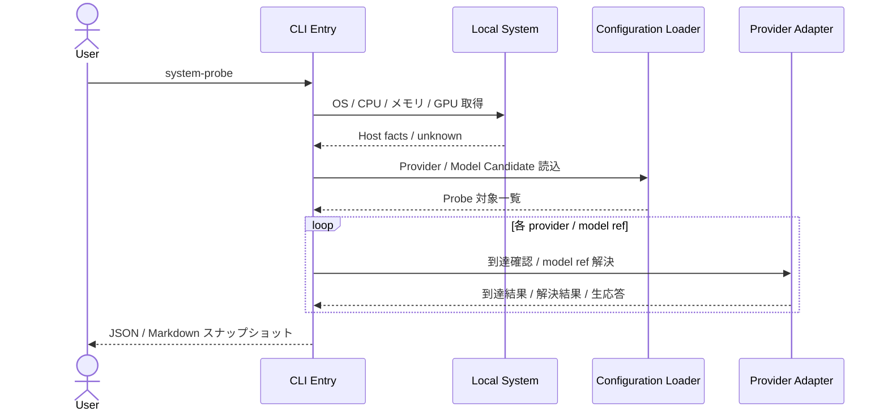

注:
- `system-probe` は CFG-00102 / CFG-00104 を入力にし、TaskProfile / Run / Comparison は読まない。
- host facts は best-effort で取得し、取得不能項目は `unknown` として表現する。これだけでは probe 全体の失敗にしない。
- Run 設定や TaskProfile を読んだ prompt 組立は本フローに含めない。
- `provider status` は別フロー (FLW-00010) とし、本フローは host facts と登録済み Model Candidate の横断観測に集中する。
- `config dry-run` は別フロー (FLW-00009) とし、本フローは host facts と provider / model の横断観測に集中する。

## FLW-00009 Run 設定の dry-run 事前確認

関連: FUN-00407, NFR-00002, NFR-00302

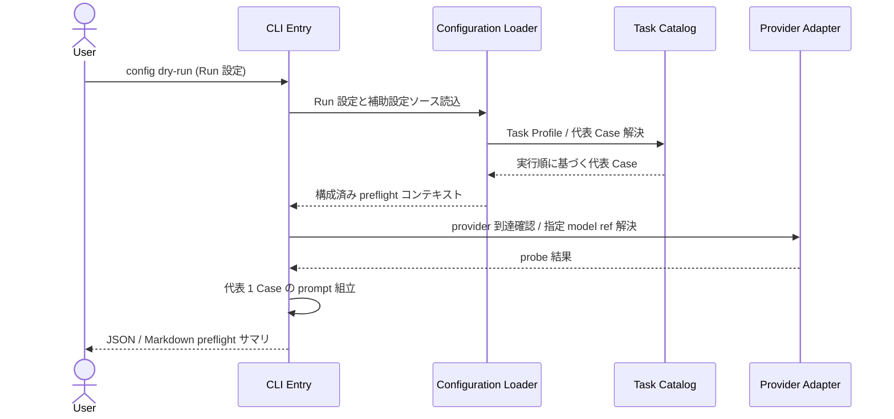

注:
- 主入力は Run 設定であり、host facts 収集や全 Model Candidate 走査は行わない。
- prompt 組立は Run で実際に使う順序から決まる代表 1 Case のみを対象とし、実推論・採点・Result Store 書込は行わない。
- `system-probe` を置き換えるものではなく、Run 実行前の個別 preflight 面として位置づける。
- `model warmup` は別フロー (FLW-00012) とし、本フローでは provider 実行を伴うロード操作を行わない。

## FLW-00010 provider の起動状態と inventory 確認

関連: FUN-00408, NFR-00002, NFR-00302

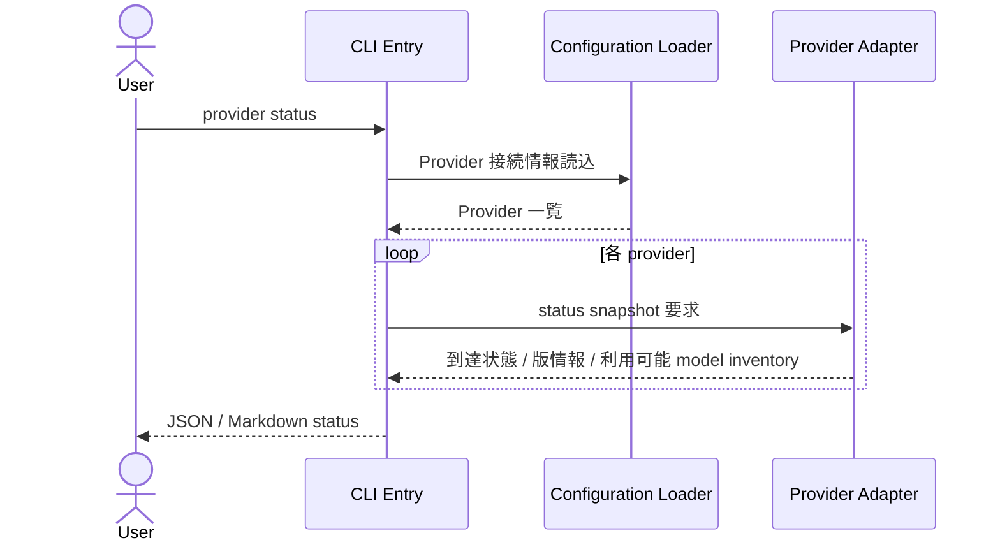

注:
- host facts、Model Candidate との照合、TaskProfile / Run 読込は本フローに含めない。
- `system-probe` は登録済み Model Candidate と host snapshot の横断観測、`provider status` は provider inventory の直接確認に責務を分ける。

## FLW-00011 model の pull

関連: FUN-00409, NFR-00002, NFR-00302

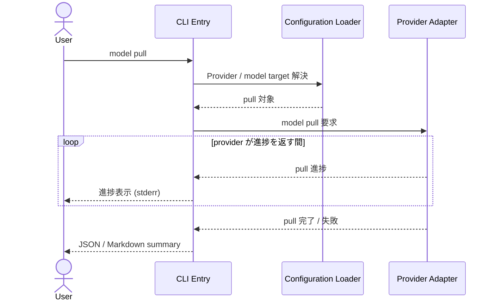

注:
- TaskProfile / Run / host facts は読まない。
- `run` / `system-probe` / `config dry-run` / `model warmup` は本フローを暗黙起動しない。

## FLW-00012 model の warmup

関連: FUN-00410, NFR-00002, NFR-00302

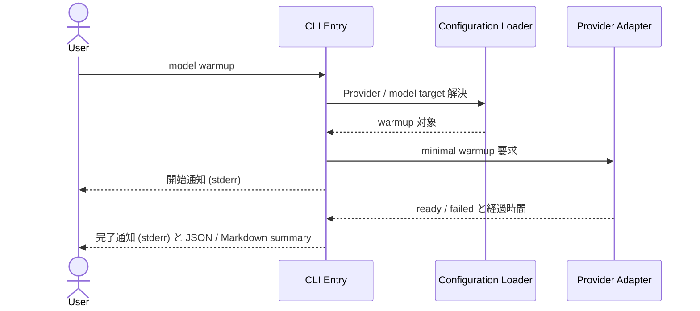

注:
- `config dry-run` と異なり、実際の provider 実行を 1 回行う。
- TaskProfile / Run 設定由来の prompt 組立、採点、Result Store 書込は行わない。

## FLW-00004 過去 Run の一覧確認

関連: FUN-00401

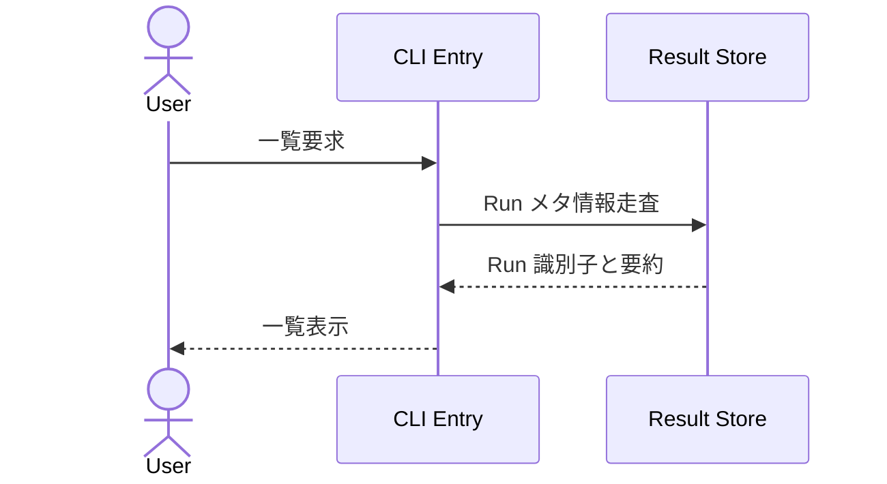

## エラー処理の方針

| ID | 方針 |
| --- | --- |
| FLW-00101 | 復旧可能なエラー (個別 Trial の失敗等) は記録して継続する |
| FLW-00102 | 復旧不可能なエラー (設定不整合、Result Store 書込不可等) は Run 開始前に検知して中断する |
| FLW-00103 | Run 中の中断時、書込済み Trial は失われない。集計値は欠損として処理される |
