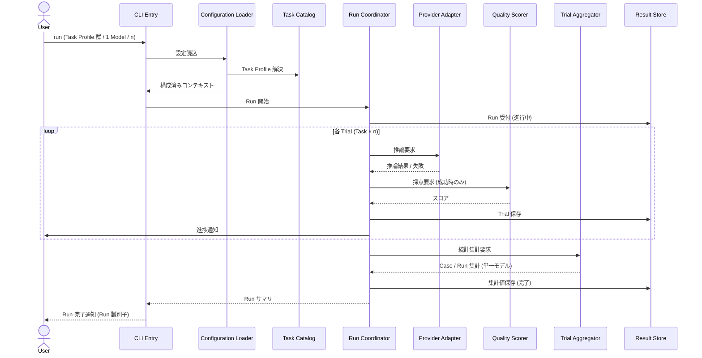
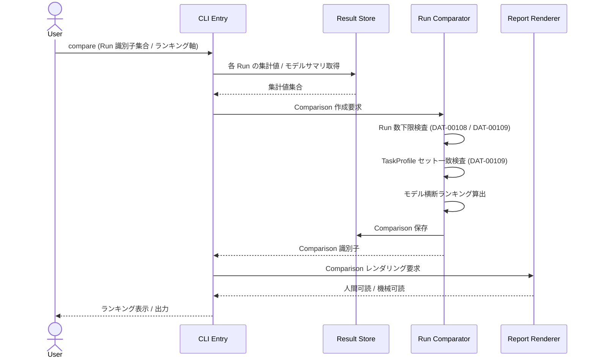
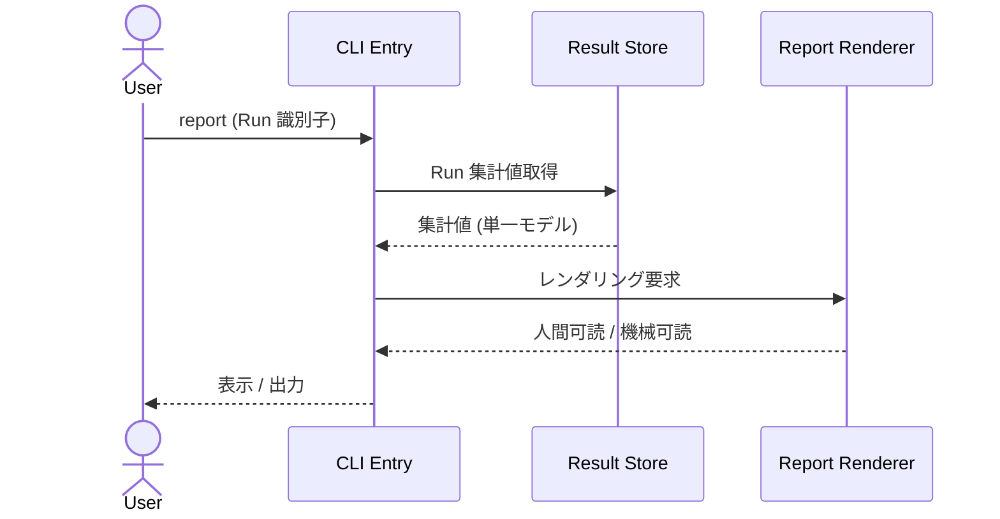
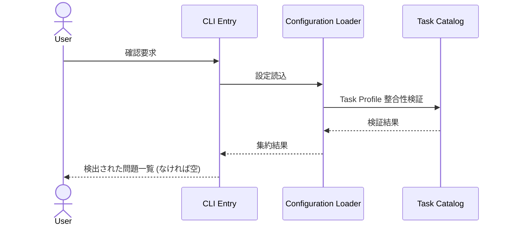
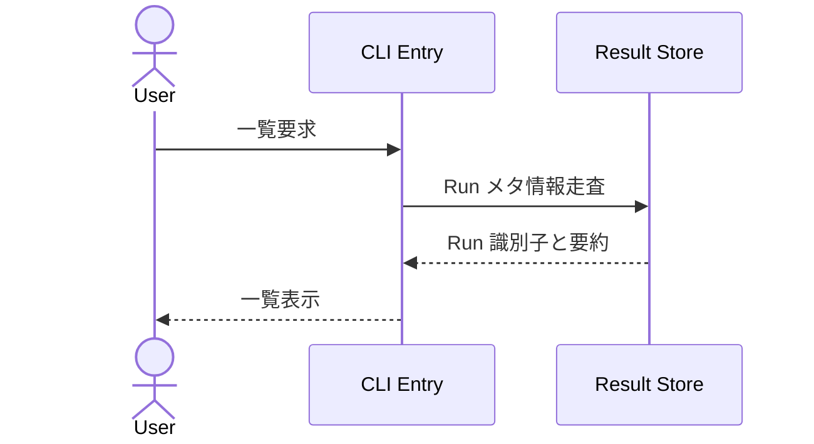

# 04. 主要フロー (Workflows)

ユーザー操作 1 つに対する、コンポーネント間の連携を概念レベルで示します。シーケンス図はあくまで責務の流れを示すもので、実装シグネチャを規定しません。

## フロー一覧

| ID | フロー | トリガ |
| --- | --- | --- |
| FLW-00001 | (superseded by FLW-00005) Run の実行 | ユーザーが対象を指定して開始 |
| FLW-00002 | 結果の確認 | ユーザーが Run 識別子を指定 |
| FLW-00003 | 登録内容の整合性確認 | ユーザーが明示的に確認を要求 |
| FLW-00004 | 過去 Run の一覧確認 | ユーザーが一覧を要求 |
| FLW-00005 | Run の実行 (1 Run = 1 Model) | ユーザーが 1 Model + Task Profile 群を指定して開始 |
| FLW-00006 | Comparison の作成 | ユーザーが Run 識別子集合を指定 |

## FLW-00001 (superseded by FLW-00005) Run の実行

複数 ModelCandidate をループで回す代フローとして記述していた。1 Run = 1 Model 方針 (FUN-00207, ARCH-00207) に伴い FLW-00005 で再定義した。複数モデル比較は FLW-00006 (Comparison の作成) と組み合わせる。

## FLW-00005 Run の実行 (1 Run = 1 Model)

関連: FUN-00207, FUN-00202, FUN-00204, FUN-00205, FUN-00206, NFR-00501, NFR-00502

注:
- Run は 1 ModelCandidate に限定される。複数モデルを比較したい場合は、ユーザーが provider 上でモデルを入れ替えて複数回 Run を実行し、その後 FLW-00006 で束ねる。
- 個別 Trial の失敗は Run 全体を停止させない (FUN-00204)。
- 進捗通知の媒体は実装フェーズで決定する。

## FLW-00006 Comparison の作成

関連: FUN-00308, FUN-00309, FUN-00310, ARCH-00206, NFR-00201

注:
- 指定された Run 集合が 2 件未満の場合、Run Comparator は Comparison を生成せず、エラーをユーザーに返す (DAT-00108 / DAT-00109)。
- TaskProfile セットが不一致な Run 集合を指定された場合、Run Comparator は Comparison を生成せず、不一致をユーザーに返す。
- ランキング軸の指定がない場合、Comparison の既定軸 (CFG-00207) を用いる。

## FLW-00002 結果の確認

関連: FUN-00307, FUN-00302, FUN-00303, FUN-00305, NFR-00004

ランキング表示は本フローの対象外とし、Comparison を作成する FLW-00006 で表示する。

## FLW-00003 登録内容の整合性確認

関連: FUN-00105, FUN-00402

検証内容の例 (実装で詳細化):
- 参照される provider 種別が登録済みか
- TaskProfile が必須要素 (Case / 評価契約) を満たしているか
- 認証情報が必要な provider に対して、対応する環境変数が解決可能か

## FLW-00004 過去 Run の一覧確認

関連: FUN-00401

## エラー処理の方針

| ID | 方針 |
| --- | --- |
| FLW-00101 | 復旧可能なエラー (個別 Trial の失敗等) は記録して継続する |
| FLW-00102 | 復旧不可能なエラー (設定不整合、Result Store 書込不可等) は Run 開始前に検知して中断する |
| FLW-00103 | Run 中の中断時、書込済み Trial は失われない。集計値は欠損として処理される |
