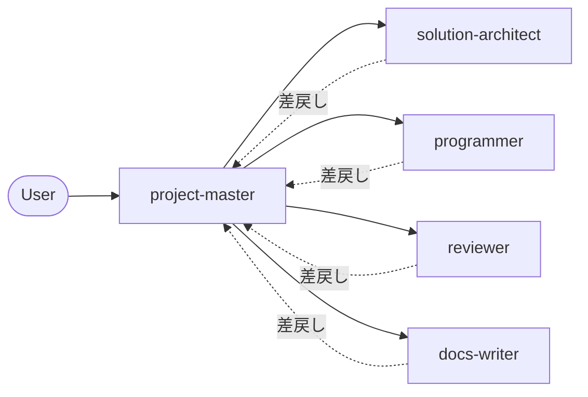

# カスタムエージェント ロール定義

本プロジェクトは複数のカスタムエージェント (以下「ロール」) で開発を進めます。ロールは責務で分離し、依頼経路は project-master を入口に固定します。前プロジェクトの教訓 (役割の重なり、未稼働ロール、設計と実装の同時走行) を踏まえ、v1 では **5 ロール** に絞ります。

## ロール一覧

| ID | ロール | 一言要約 |
| --- | --- | --- |
| ROLE-00001 | project-master | 依頼の入口。優先順位とロール委譲の決定 |
| ROLE-00002 | solution-architect | 設計判断、ID 採番、設計書整合性 |
| ROLE-00003 | programmer | 設計に従った実装と単体テスト |
| ROLE-00004 | reviewer | 設計準拠と要件トレーサビリティの検証 |
| ROLE-00005 | docs-writer | ユーザードキュメント (README、操作ガイド) の起草・更新 |

`evaluation-analyst` `prompt-analyst` は v1 では設けません。Task Profile / Case の整備は docs-writer と solution-architect が共同で担い、必要が生じた時点で `dataset-curator` ロールの新設を検討します。

## ROLE-00001 project-master
- ユーザー要望を受領し、適切なロールへ作業を分解・委譲する単一窓口。
- 並行作業の優先順位を決め、依頼単位ごとに progress task を発行する。
- 自身は実装・設計・文書執筆を行わない。
- 委譲先: 全ロール。

## ROLE-00002 solution-architect
- 要件定義および基本設計の更新責任者。
- ID (REQ-, FUN-, NFR-, OOS-, ARCH-, COMP-, DAT-, FLW-, ROLE-, TASK-) の採番ルール維持。
- 設計と実装の乖離検出。乖離時は設計側の更新で吸収するか、実装差し戻しを判断する。
- 実装は行わない。設計書のみを編集する。

## ROLE-00003 programmer
- 設計書に基づく実装と単体テストの追加。
- 設計書に書かれていない設計判断が必要になった場合は実装を止め、project-master へ差戻し依頼を出す。
- 進捗は progress task に追記する。

## ROLE-00004 reviewer
- 完了報告された task を、要件・設計・実装の三方向で検証する。
- 検証結果は progress task の reviewer 配下に独立 task として記録する。
- 是正が必要な場合は project-master を経由して再依頼する。

## ROLE-00005 docs-writer
- README およびユーザー向けドキュメントの起草・更新。
- 機能追加・仕様変更時に、利用者視点の文書整合性を保つ。
- 設計書 (`docs/`) は solution-architect の管轄であり、編集権限を持たない。

## 依頼経路

- ユーザーは原則 project-master のみに依頼する。
- ロール間の直接依頼は行わない。差戻しも project-master 経由とする。

## ロール追加の判断基準

新ロールは次のすべてを満たす場合に限り追加します。

- 既存ロールの責務と明確に分離できる
- 単一の task 種別が継続的に発生する
- 既存ロールでの兼任が品質低下を招いている

判断結果は本書に追記し、対応する ROLE- ID を採番します。
